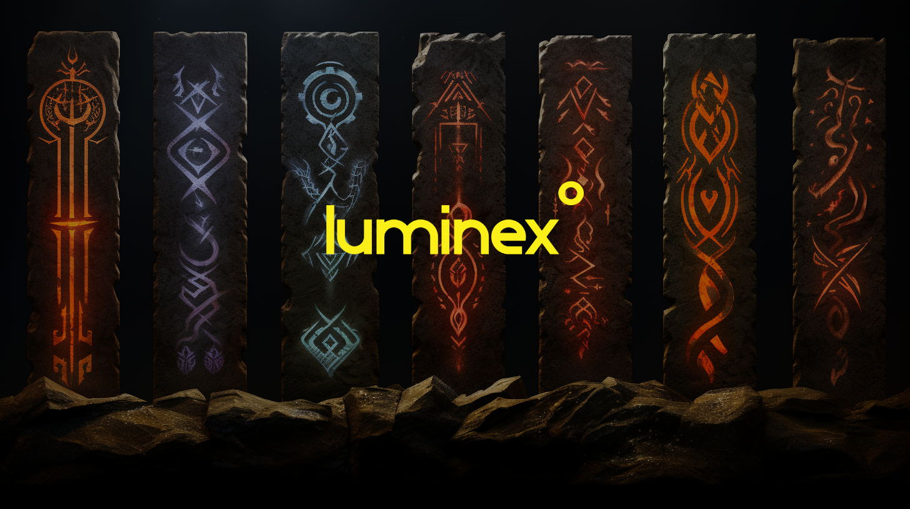

# Luminex Rune Implementation by Rodarmor

# Introduction to Runes

Runes is a proposed fungible token protocol for the Bitcoin network that aims to be simple and UTXO-based. Distinct from existing protocols like BRC-20 and RGB, Runes does not rely on off-chain data or demand a native token. Instead, rune balances are held by UTXOs, and transactions are identified using specific script conditions. Runes also introduces a method for the issuance of new tokens using human-readable symbols. Luminex, in line with this advancement, is launching a Rune Issuance tool, allowing anyone to effortlessly issue their Rune token, with users only covering the network fees.

**[Rodarmor's Runes blog post](https://rodarmor.com/blog/runes/?ref=blog.luminex.io)**

----------

## Why Luminex's Implementation Stands Out

A notable challenge with the initial Rune blog post was its absence of detailed specifications. In light of this, Luminex has crafted an implementation that emerges as the closest reflection of the blog's insights.

Why does our approach at Luminex stand out? The answer can be found in our adherence to two crucial choices outlined in the referenced blog: the adoption of  **PrefixVarint**  and the  **Base26 encoding**  methodology (where A=1).

The blog highlights the use of PrefixVarint by stating:

> "Integers are encoded as prefix varints, where the number of leading ones in a varint determines its length in bytes."

By leveraging this technique, our Rune implementation optimizes transfer size, making it possible for around 12 transfers per output, as compared to 8 with the standard varint. This is a significant improvement in transaction efficiency.

Our decision to utilize the Base26 with A =1 encoding methodology is rooted in the blog's guidance, which describes:

> "SYMBOL is a base 26-encoded human-readable symbol, similar to that used in ordinal number sat names. The only valid characters are A through Z."

In essence, Luminex's Rune implementation isn't just efficient—it captures the very spirit and vision of the original recommendations, ensuring a balance between efficiency and usability.

----------

## Frequently Asked Questions (FAQ)

**1. What is RUNE?**  
RUNE is a proposed fungible token protocol for the Bitcoin network, aiming to be simple and UTXO-based. It allows for the issuance and management of tokens within the Bitcoin ecosystem.

**2. How many characters can a rune symbol have?**  
There isn't a strict limit on the number of characters for a rune symbol. However, it's essential to ensure the OP_RETURN data fits within 80 bytes. While it could stretch to around 100 characters, it's safer not to push the boundaries too far.

**3. How do DECIMALS work?**  
The DECIMALS specification hasn't been detailed in the blog post. As a precaution, we advise keeping DECIMALS set to 0 at present.

**4. What happens if I transfer a UTXO containing RUNE without the OP_RETURN R?**  
Per the blog post, if you transfer a UTXO with RUNE without the requisite OP_RETURN R, all RUNEs in that UTXO will be burned. We recommend setting up a new address exclusively for receiving RUNEs and refraining from transferring any UTXO from there until there's wallet integration.

**5. What can I do after issuing a RUNE?**  
Currently, there are limited actions available after issuing a RUNE. However, indexers and wallet providers are actively working on RUNE integration. Rest assured, Luminex is committed to supporting advancements in the Bitcoin domain.

**6. Can RUNES be traded, transferred, or sold?**  
Please refer to the response for question #5.

----------
